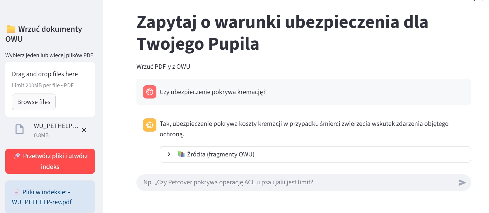
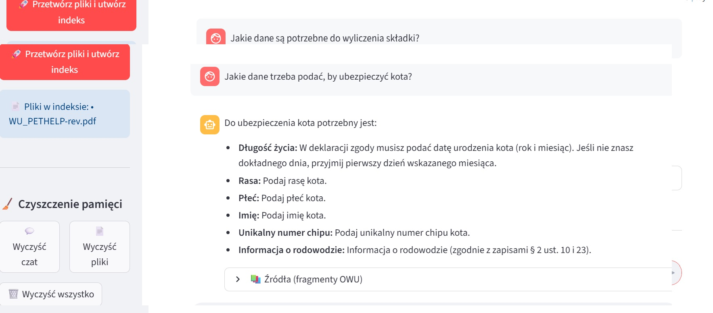

hide:
    - toc
    
#**Asystent ubezpieczeń dla zwierząt**

# Aplikacja typu chat, która ma pomóc w odnajdywaniu odpwiedzi na pytania dotyczące warunków ubezpieczeń dla zwierząt na podstawie wgranego pliku OWU w formacie PDF. Odpowiedzi są opatrzone cytatami z dokumentu.

** Narzędzia
**Python** / **Llamaindex** / **HuggingFaceEmbedding** / **LLM** / **Streamlit** 

