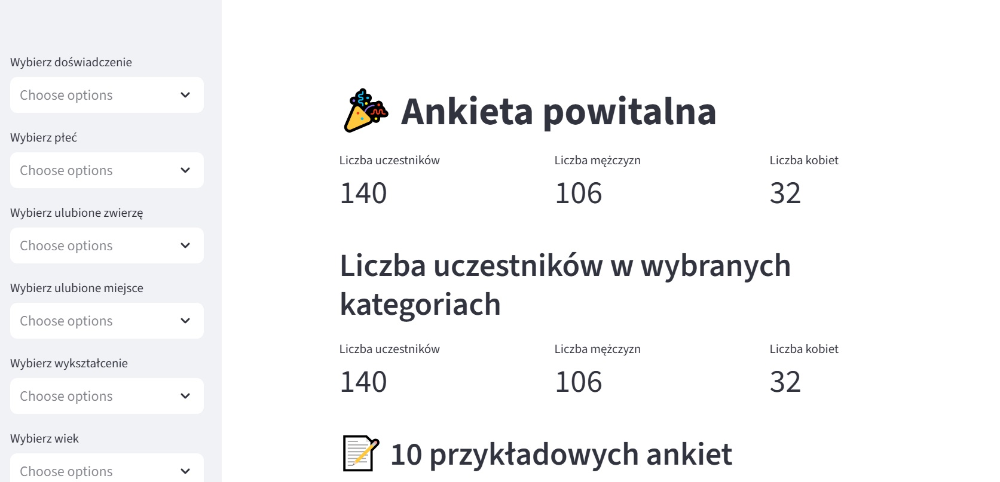
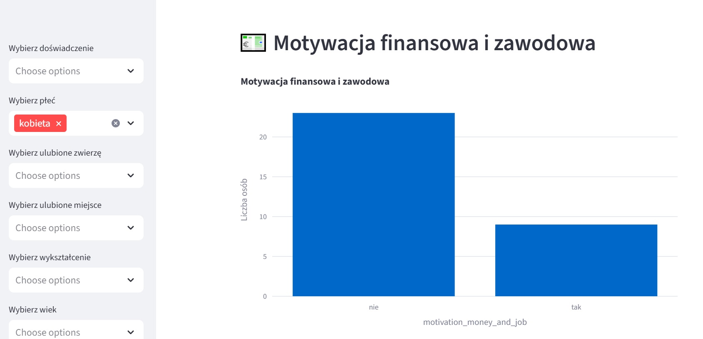

#**Aplikacja ukazująca strukturę uczestników kursu programowania**

To pierwsza zbudowana przeze mnie aplikacja. Bazą były dane z amkiety przeprowadzonej wśród uczestników kursu. Pozwala ona na ukazanie motywacji do nauki programowania wśród uczniów wybranych według zmiennych: liczba lat doświadczenia zawodowego, wiek, płeć, ulubione zwierzę, smak, hobby, miejsce spędzenia czasu itp. 

Uczestnicy mogli określić swoją motywację jako: finansową i zawodową, innowacja, rozwój osobisty, wyzwanie, kariera, kreatywność i innowacje, chęć pracowania zdalnie.

### Aplikacji posiada również "licznik" uczestników z podziałem na płeć

### Przykładowy wybór ankietowanego według kluczy: płeć i doświadczenie

### Rodzaj motywacji u kobiet

### W jakich branżach pracują uczestniczki kursu
