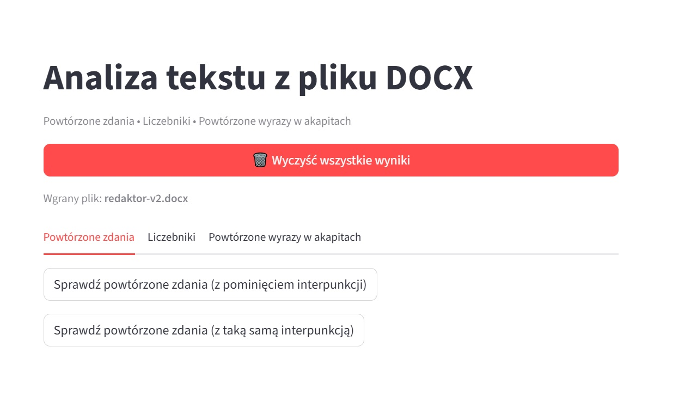
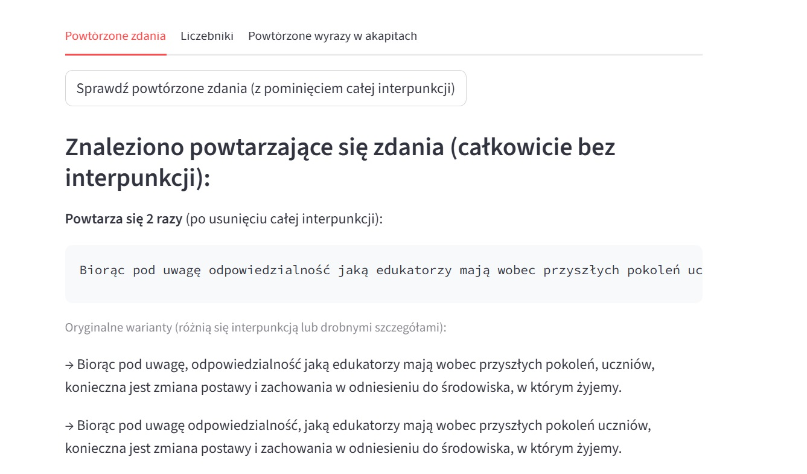
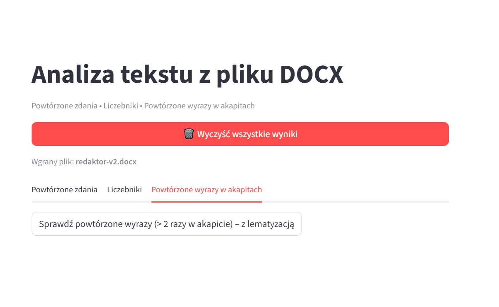

# Pomocnik redaktora

To projekt, który ma za zadanie zbudować narzędzie pomocne w redakcji językowej plików tekstowych, szczególnie dłuższych publikacji. Podstawą będzie plik wgrany przez użytkownika, oczyszczony technicznie (np. podwójne spacje). Aplikacja będzie opierać się na bibliotece regex i SpaCy. 

Po wgraniu pliku docx użytkownik ma do wyboru trzy zakładki. Pierwsza umożliwia sparwdzenie na dwa sposoby, czy w pliku znajdują się powtórzone zdania. Pierwsza funkcja wykorzystuje bibliotekę re i sprawdza zdanie pod kątem interpunkcji - wyłapuje takie dokładnie takie same zdania z taką samą interpunkcją. Drugi przycisk wykorzystuje bibliotekę SpaCy i pomija znaki interpunkcyjne, porównując tylko użyte wyrazy, wychwytuje całą frazę.

Druga zakładka umożliwia wyszukanie i wyświetlenie miejsc w tekście, w których użyto liczb/liczebników, co jest przydatne dla redaktorów, którzy muszą np. ujednolicac zapisy w tekstach.

Trzecia zakładka tworzy zestawienie najczęściej powtarzających się wyrazów w obrębie jednego akapitu. Obecna funkcja wypisuje dany lemat już od powyżej dwóch wystąpień, jednak należy zastanowić się nad podniesieniem częstotliwości wystąpienia i poszerzeniem/skróceniem listy STOP WORDS.

